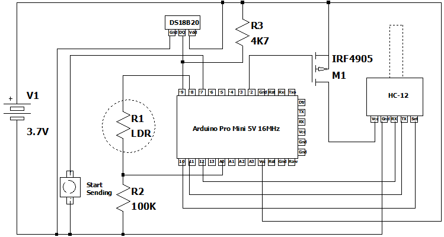

# Arduino Low Power Secure Wireless Communication

This allows us to communicate between an Arduino Pro Mini and a Raspberry Pi.

## Arduino Schematic

## Proof of Concept

There are code examples in C# (.NET core), Javascript and Python

## Code Example

C# / .NET core code for Raspberry Pi

C++ code (using Arduino IDE) for Arduino Pro Mini (5V 16MHz)

.Net code for Raspberry Pi based on [Codeproject article](https://www.codeproject.com/Articles/5266758/Easy-Set-Up-of-NET-Core-on-Raspberry-Pi-and-Remote)

